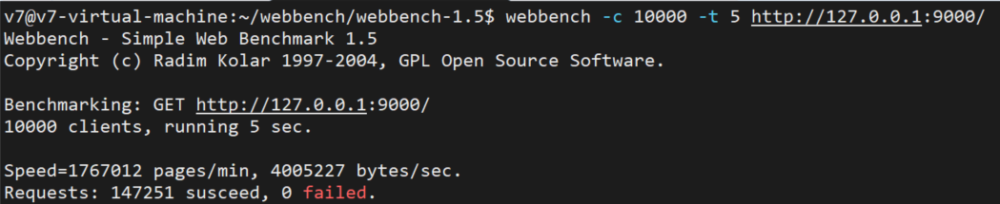

# 基于Linux的轻量级多线程HTTP服务器

## 项目介绍

轻量级的Web服务器，解析GET和POST请求，支持web端用户注册及登录，并请求服务器上的文件，支持HTTP长连接，并添加定时器实现定时断开空闲连接，实现了日志功能，记录服务器运行状态。

## 核心技术

* 使用线程池 + 非阻塞IO + epoll边缘触发(ET) 模拟Proactor事件处理方式，实现高并发处理请求
* 使用主从状态机解析HTTP请求报文，支持GET和POST请求
* 使用数据库连接池，支持web端用户注册及登录，并请求服务器的图片和视频文件
* 支持HTTP长连接，并添加定时器处理非活跃连接
* 实现同步/异步日志系统，记录服务器运行状态
* 基于webbench压力测试可以实现上万的并发连接

## 开发环境及相关工具
* Ubuntu 18.04.1 LTS
* g++ 7.5.0
* Visual Studio Code
* MySQL 5.7.38

## 压力测试
关闭日志功能后，使用webbench第三方工具，完成压力测试，结果如下

`webbench -c 10000 -t 5 http://127.0.0.1:9000/`

（`-c 10000` 并发连接数为10000 `-t 5` 测试时间5s）

## 待更新
* 使用RAII手法封装互斥器(pthrea_mutex_t)、 条件变量(pthread_cond_t)等线程同步互斥机制，使用RAII管理文件描述符等资源
* 在有限状态机中采用unordered_map来记录参数方便使用
* 定时器使用小根堆优化复杂度
* 更新前端功能