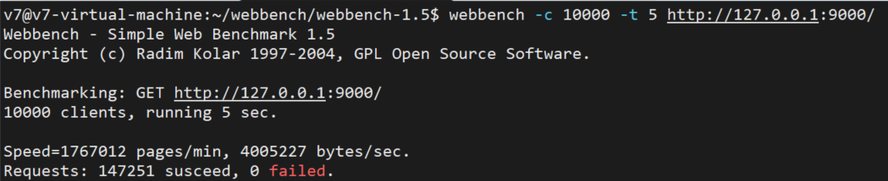

# Webbench实现的核心原理

父进程fork若干个子进程，每个子进程在用户要求时间或默认的时间内对目标web循环发出实际访问请求，
父子进程通过**管道**进行通信，
子进程通过管道写端向父进程传递在若干次请求访问完毕后记录到的总信息
父进程通过管道读端读取子进程发来的相关信息，
子进程在时间到后结束，父进程在所有子进程退出后统计并给用户显示最后的测试结果，然后退出。

# 本项目的webbench测试结果
关闭日志功能后，使用10000条并发连接数在5s时间内的测试结果如下

`webbench -c 10000 -t 5 http://127.0.0.1:9000/`

